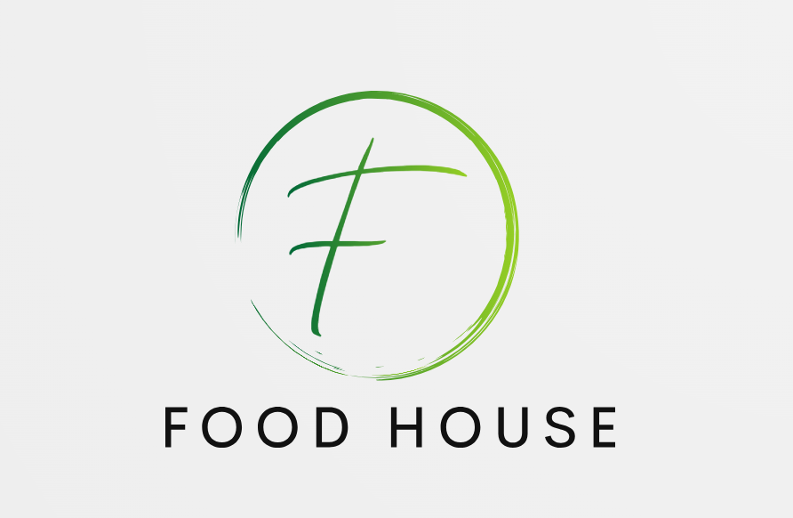

<h1 align="center">
  
FOOD HOUSE

# *Introduction* 
The purpose of this project is to develop the front-end of an application that dynamically displays COVID status information by consuming the CovidTracker API.

# *Description of the project* 
In response to the current demand for technological solutions to address the challenges presented by the Covid-19 pandemic, our development team presents the Covid-19 Dashboard front-end development project. 

This project's main objective is to provide an interactive and visually appealing platform that allows users to access and analyze relevant data on the behavior of the virus, including the number of infections, recovered and vaccinated people. 

It is a React-based web application that allows users to visualize in an intuitive and understandable way the latest data related to Covid-19. Through this Dashboard, it seeks to provide an effective tool for situation analysis and informed decision making. 

An example of how our landing page looks like can be found in the following image:

 

# *Functionalities* 
The disease.sh API is consumed to get the data. 
The page is responsive. 
The page filters by country. 

# *How users can use it* 
In order to visualize this project properly you need react and axios installed. 
You can run the project with: 
  
    npm start
  
To display it in the browser, open your local host: 
  
    http://localhost:5173

The page will automatically reload if you make changes to the code. 
You will see the build errors and lint warnings in the console. 

# *Learn more about Laravel*  
Laravel is a web application framework with expressive, elegant syntax. We believe development must be an enjoyable and creative experience to be truly fulfilling. Laravel takes the pain out of development by easing common tasks used in many web projects, such as:

- [Simple, fast routing engine](https://laravel.com/docs/routing).
- [Powerful dependency injection container](https://laravel.com/docs/container).
- Multiple back-ends for [session](https://laravel.com/docs/session) and [cache](https://laravel.com/docs/cache) storage.
- Expressive, intuitive [database ORM](https://laravel.com/docs/eloquent).
- Database agnostic [schema migrations](https://laravel.com/docs/migrations).
- [Robust background job processing](https://laravel.com/docs/queues).
- [Real-time event broadcasting](https://laravel.com/docs/broadcasting).

Laravel is accessible, powerful, and provides tools required for large, robust applications.
Laravel has the most extensive and thorough documentation and video tutorial library of all modern web application frameworks, making it a breeze to get started with the framework.

You may also try the Laravel Bootcamp, where you will be guided through building a modern Laravel application from scratch.

If you don't feel like reading, Laracasts can help. Laracasts contains over 2000 video tutorials on a range of topics including Laravel, modern PHP, unit testing, and JavaScript. Boost your skills by digging into our comprehensive video library. 

# *Technologies used*  

      

 

# *Authors of the project* 
This project exists thanks to all the people who contribute: 
  - Anaïs -- https://github.com/Anais-RV 
  - Madelaine -- https://github.com/Madelainepereira 
  - Maite --  
  - Miriam -- https://github.com/MiriamVarela 
  - Sara -- https://github.com/Sara-Poyo-Pastor
